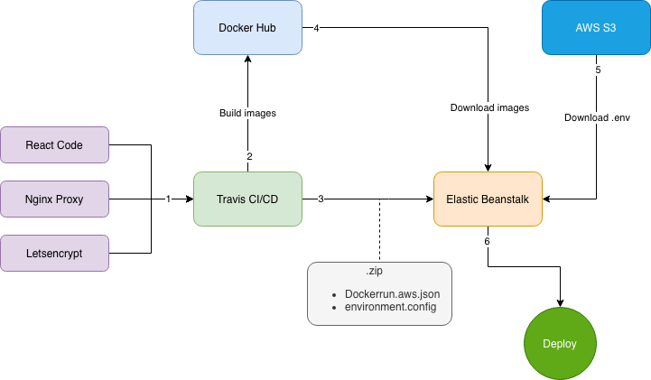

# Economic App Frontend

## Install it locally

-   `npm install`
-   `npm start`

By default it will run in the port `8080`. If you need to change the port, you can change it in the file `server/port.js`

## Install it remotely

The whole system are linked with a CI/CD process. So all you need to do is:

-   `git push origin master`

By default we are using the branch *master* for production, but it can be changed if it's needed.

## Production Architecture Flow

1.  We have the React app that will be running with an nginx in the back. The config can be found in the `Dockerfile`. Also we have an nginx-proxy to route all the http/https requests thanks to letsencrypt that will be creating the ssl certificates and updating the certificate in the nginx-proxy.
2.  Travis CI/CD will create and image of
    -   react app
    -   nginx-proxy
    -   letsencrypt

    And it will upload all the ready images in the hub of Docker(https://hub.docker.com/)
3.  Trvis will create a zipfile with the conf of `dockerrun.aws.json` and `environment.conf`.
4.  EB will download all the images from docker hub
5.  EB will download the .env file from a private S3 bucket to use all the proper environments variables.
6.  EB will deploy and finally run all the containers.